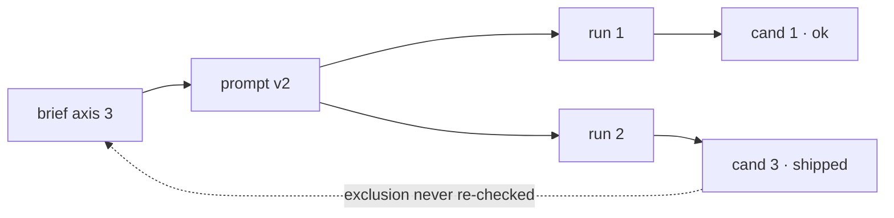

<!-- planning:deferred -->
Purpose: the copy-paste form for each trigger, so a diagram costs a minute rather than a decision.
Read when: a finding has hit one of the triggers and the shape is not obvious.
Verified: 2026-08-23 — no automated check reads the drawings. What is checked is
that this page and `visualise` between them define every trigger, form and floor
word the registry declares; a rule in `planning-tools/validate.py` re-runs that on
every commit, so a word deleted from here fails the build.

# Forms

Four shapes cover almost everything. Pick by trigger, not by taste.

## `hops` — the dependency graph

The default here. Tasks as nodes, the critical path marked, and the finding hung
off the edge it is about.

```
spec ──▶ schema ──▶ api ──▶ client
           │                   ▲
           └──▶ migration ─────┘
                    ▲ the plan runs these two in parallel; client needs both
```

Past about six nodes this is a mermaid graph, and this is the family where that
threshold is crossed most often.

## `location` — the coverage grid

A silence audit already has this shape: what a plan of this kind has to settle
down one axis, what this plan settles across the other.

```
                       stated   owner   date
scope                    yes     yes     yes
rollback                 yes      ——      ——    ← named, nobody owns it
data migration            ——      ——      ——    ← never mentioned
on-call during cutover    ——      ——      ——    ← never mentioned
```

The blank row is the finding. A paragraph saying the plan never mentions
something is the slowest way to say it.

## `ordering` — two lanes

When two pieces of work were sequenced as though independent. Time to the right,
the shared resource marked where they collide.

```
team A   schema change ────────────┐
team B          feature on old schema ──┴── ships
                                        ▲ B built against a schema A replaced
```

## `disagreement` — two columns

An estimate against a constraint, a stated goal against a stated non-goal, a
capacity against a load.

```
                  the plan says      the constraint says
cutover window    4 hours            2 hours (freeze)   ← disagree
rollback          "revert the PR"    the migration is one-way  ← disagree
```

## Mermaid, when it is a graph

More than about six nodes, or branching and merging that ASCII would misalign.
It needs a renderer, so it is a trade.

````

````

Keep node labels to what was opened. A mermaid graph is as easy to fill with
untraced edges as a sentence is, and harder to argue with, which is the danger.

## Drawing them

- Box characters `┌ ┐ └ ┘ ├ ┤ ┬ ┴ ┼ │ ─`, arrows `──▶ ▲ ▼ └─`
- Keep the whole thing under about 70 columns so nothing wraps in a terminal
- Circled numbers `① ② ③` for marks; they survive being pasted anywhere
- Align by spaces, never tabs
- A legend under the drawing, not inside it

## What none of these do

They do not carry evidence. A map shows where a finding is, not that anyone
looked — the grade beside the finding says that, and a beautifully drawn
`asserted` is still `asserted`.
